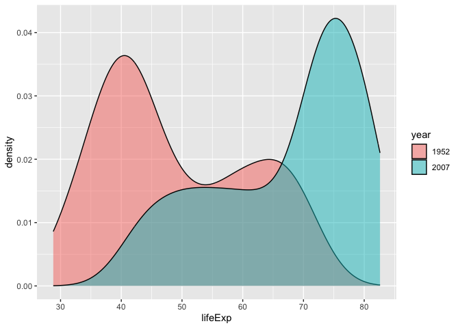

## Instructions
Answer the following questions and complete the exercises in RMarkdown. Please embed all of your code and push your final work to your repository. Your final lab report should be organized, clean, and run free from errors. Remember, you must remove the `#` for the included code chunks to run. Be sure to add your name to the author header above. For any included plots, make sure they are clearly labeled. You are free to use any plot type that you feel best communicates the results of your analysis.  

**In this homework, you should make use of the aesthetics you have learned. It's OK to be flashy!**

Make sure to use the formatting conventions of RMarkdown to make your report neat and clean!  

## Load the libraries

```r
library(tidyverse)
library(janitor)
library(here)
library(naniar)
library(ggthemes)
library(RColorBrewer)
```


```r
options(scipen = 999)
```

## Resources
The idea for this assignment came from [Rebecca Barter's](http://www.rebeccabarter.com/blog/2017-11-17-ggplot2_tutorial/) ggplot tutorial so if you get stuck this is a good place to have a look.  

## Gapminder
For this assignment, we are going to use the dataset [gapminder](https://cran.r-project.org/web/packages/gapminder/index.html). Gapminder includes information about economics, population, and life expectancy from countries all over the world. You will need to install it before use. This is the same data that we will use for midterm 2 so this is good practice.

```r
#install.packages("gapminder")
library("gapminder")
```

## Questions
The questions below are open-ended and have many possible solutions. Your approach should, where appropriate, include numerical summaries and visuals. Be creative; assume you are building an analysis that you would ultimately present to an audience of stakeholders. Feel free to try out different `geoms` if they more clearly present your results.  

**1. Use the function(s) of your choice to get an idea of the overall structure of the data frame, including its dimensions, column names, variable classes, etc. As part of this, determine how NAs are treated in the data.**  

```r
summary(gapminder)
```

```
##         country        continent        year         lifeExp     
##  Afghanistan:  12   Africa  :624   Min.   :1952   Min.   :23.60  
##  Albania    :  12   Americas:300   1st Qu.:1966   1st Qu.:48.20  
##  Algeria    :  12   Asia    :396   Median :1980   Median :60.71  
##  Angola     :  12   Europe  :360   Mean   :1980   Mean   :59.47  
##  Argentina  :  12   Oceania : 24   3rd Qu.:1993   3rd Qu.:70.85  
##  Australia  :  12                  Max.   :2007   Max.   :82.60  
##  (Other)    :1632                                                
##       pop               gdpPercap       
##  Min.   :     60011   Min.   :   241.2  
##  1st Qu.:   2793664   1st Qu.:  1202.1  
##  Median :   7023596   Median :  3531.8  
##  Mean   :  29601212   Mean   :  7215.3  
##  3rd Qu.:  19585222   3rd Qu.:  9325.5  
##  Max.   :1318683096   Max.   :113523.1  
## 
```

```r
glimpse(gapminder)
```

```
## Rows: 1,704
## Columns: 6
## $ country   <fct> "Afghanistan", "Afghanistan", "Afghanistan", "Afghanistan", …
## $ continent <fct> Asia, Asia, Asia, Asia, Asia, Asia, Asia, Asia, Asia, Asia, …
## $ year      <int> 1952, 1957, 1962, 1967, 1972, 1977, 1982, 1987, 1992, 1997, …
## $ lifeExp   <dbl> 28.801, 30.332, 31.997, 34.020, 36.088, 38.438, 39.854, 40.8…
## $ pop       <int> 8425333, 9240934, 10267083, 11537966, 13079460, 14880372, 12…
## $ gdpPercap <dbl> 779.4453, 820.8530, 853.1007, 836.1971, 739.9811, 786.1134, …
```

```r
names(gapminder)
```

```
## [1] "country"   "continent" "year"      "lifeExp"   "pop"       "gdpPercap"
```

```r
anyNA(gapminder) 
```

```
## [1] FALSE
```


**2. Among the interesting variables in gapminder is life expectancy. How has global life expectancy changed between 1952 and 2007?**

```r
ls("package:ggthemes")[grepl("theme_", ls("package:ggthemes"))]
```

```
##  [1] "theme_base"            "theme_calc"            "theme_clean"          
##  [4] "theme_economist"       "theme_economist_white" "theme_excel"          
##  [7] "theme_excel_new"       "theme_few"             "theme_fivethirtyeight"
## [10] "theme_foundation"      "theme_gdocs"           "theme_hc"             
## [13] "theme_igray"           "theme_map"             "theme_pander"         
## [16] "theme_par"             "theme_solarized"       "theme_solarized_2"    
## [19] "theme_solid"           "theme_stata"           "theme_tufte"          
## [22] "theme_wsj"
```


```r
gapminder %>% 
  filter(lifeExp>=1952 | lifeExp<=2007) %>% 
  mutate(year=as.factor(year)) %>% 
  ggplot(aes(x=year, y=lifeExp))+
  geom_boxplot()+
  labs(title = "Global Life Expectancy Between 1952 to 2007")+
  theme(plot.title=element_text(size=rel(1), hjust = 0.5))
```

<!-- -->

**3. How do the distributions of life expectancy compare for the years 1952 and 2007?**

```r
gapminder %>% 
  filter(lifeExp>=1952 | lifeExp<=2007) %>% 
  mutate(year=as.factor(year)) %>% 
  ggplot(aes(x = lifeExp)) +
  geom_density(fill="darkseagreen3", alpha =0.4, color = "darkgrey")+
  labs(title = "Distribution of Life Expectancy")+
  theme(plot.title=element_text(size=rel(1), hjust = 0.5))
```

<!-- -->

**4. Your answer above doesn't tell the whole story since life expectancy varies by region. Make a summary that shows the min, mean, and max life expectancy by continent for all years represented in the data.**

```r
gapminder %>%
  group_by(continent) %>% 
  summarize(min_life_exp=min(lifeExp),
            mean_life_exp=mean(lifeExp),
            max_life_exp=max(lifeExp))
```

```
## # A tibble: 5 × 4
##   continent min_life_exp mean_life_exp max_life_exp
##   <fct>            <dbl>         <dbl>        <dbl>
## 1 Africa            23.6          48.9         76.4
## 2 Americas          37.6          64.7         80.7
## 3 Asia              28.8          60.1         82.6
## 4 Europe            43.6          71.9         81.8
## 5 Oceania           69.1          74.3         81.2
```


**5. How has life expectancy changed between 1952-2007 for each continent?**

```r
gapminder %>% 
  filter(lifeExp>=1952 | lifeExp<=2007) %>% 
  mutate(year=as.factor(year)) %>%
  ggplot(aes(x=year, y=lifeExp))+
  geom_boxplot()+
  facet_grid(continent~.)+
  labs(title = "Life Expectancy Between 1952-2007 for each Continent")+
  theme(plot.title=element_text(size=rel(1), hjust = 0.5))
```

<!-- -->

**6. We are interested in the relationship between per capita GDP and life expectancy; i.e. does having more money help you live longer?**
*As gdp per capita increases, life expectancy increase*

```r
gapminder %>% 
  ggplot(aes(x=log10(gdpPercap), y= lifeExp))+
  geom_point(na.rm = T)+
  geom_smooth(method=lm, se = T)+
  labs(title="Log of Per Capita GDP vs Life Expectancy")+
  theme(plot.title=element_text(size=rel(1), hjust = 0.5))
```

```
## `geom_smooth()` using formula = 'y ~ x'
```

<!-- -->

**7. Which countries have had the largest population growth since 1952?**
*Since 1952, China and India have the largest population growth.*

```r
gapminder %>% 
  filter(year==1952) %>% 
  arrange(desc(pop))
```

```
## # A tibble: 142 × 6
##    country        continent  year lifeExp       pop gdpPercap
##    <fct>          <fct>     <int>   <dbl>     <int>     <dbl>
##  1 China          Asia       1952    44   556263527      400.
##  2 India          Asia       1952    37.4 372000000      547.
##  3 United States  Americas   1952    68.4 157553000    13990.
##  4 Japan          Asia       1952    63.0  86459025     3217.
##  5 Indonesia      Asia       1952    37.5  82052000      750.
##  6 Germany        Europe     1952    67.5  69145952     7144.
##  7 Brazil         Americas   1952    50.9  56602560     2109.
##  8 United Kingdom Europe     1952    69.2  50430000     9980.
##  9 Italy          Europe     1952    65.9  47666000     4931.
## 10 Bangladesh     Asia       1952    37.5  46886859      684.
## # ℹ 132 more rows
```


```r
gapminder %>% 
  filter(year==2007) %>% 
  arrange(desc(pop))
```

```
## # A tibble: 142 × 6
##    country       continent  year lifeExp        pop gdpPercap
##    <fct>         <fct>     <int>   <dbl>      <int>     <dbl>
##  1 China         Asia       2007    73.0 1318683096     4959.
##  2 India         Asia       2007    64.7 1110396331     2452.
##  3 United States Americas   2007    78.2  301139947    42952.
##  4 Indonesia     Asia       2007    70.6  223547000     3541.
##  5 Brazil        Americas   2007    72.4  190010647     9066.
##  6 Pakistan      Asia       2007    65.5  169270617     2606.
##  7 Bangladesh    Asia       2007    64.1  150448339     1391.
##  8 Nigeria       Africa     2007    46.9  135031164     2014.
##  9 Japan         Asia       2007    82.6  127467972    31656.
## 10 Mexico        Americas   2007    76.2  108700891    11978.
## # ℹ 132 more rows
```

**8. Use your results from the question above to plot population growth for the top five countries since 1952.**

```r
gapminder %>% 
  mutate(year=as.factor(year)) %>%
  ggplot(aes(x=year, y=pop))+
  geom_point(na.rm = T)+
  geom_smooth(method=lm, se = T)
```

```
## `geom_smooth()` using formula = 'y ~ x'
```

<!-- -->


**9. How does per capita GDP growth compare between these same five countries?**

**10. Make one plot of your choice that uses faceting!**

## Push your final code to GitHub!
Please be sure that you check the `keep md` file in the knit preferences. 
