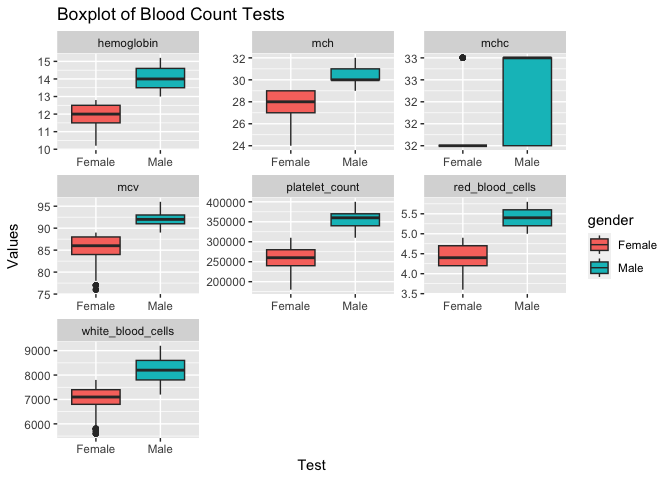
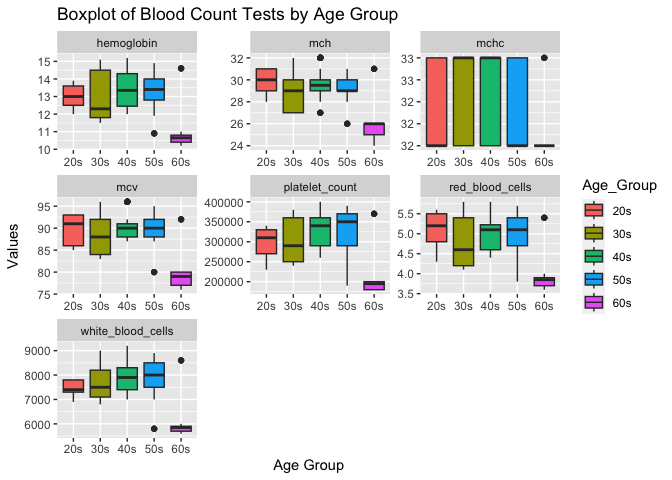

## Instructions
This homework is a bit less traditional this week. There are some errors in the code below. In addition add notes and titles to the code chunks that explains what the code chunck does. Use AI tools, notes from class, or any other resources to help fix the errors. Feel free to edit any plots to your preference. Don't forget to answer the two questions at the bottom. Upon completion, you should not have to '#' out any of the code chunks.

Push your final work to your repository. Your final lab report should be organized, clean, and run free from errors. Remember, you must remove the `#` for the included code chunks to run. Be sure to add your name to the author header above.   

Again make sure to use the formatting conventions of RMarkdown to make your report neat and clean!  


```r
library(tidyverse)
```

```
## ── Attaching core tidyverse packages ──────────────────────── tidyverse 2.0.0 ──
## ✔ dplyr     1.1.4     ✔ readr     2.1.4
## ✔ forcats   1.0.0     ✔ stringr   1.5.1
## ✔ ggplot2   3.4.4     ✔ tibble    3.2.1
## ✔ lubridate 1.9.3     ✔ tidyr     1.3.0
## ✔ purrr     1.0.2     
## ── Conflicts ────────────────────────────────────────── tidyverse_conflicts() ──
## ✖ dplyr::filter() masks stats::filter()
## ✖ dplyr::lag()    masks stats::lag()
## ℹ Use the conflicted package (<http://conflicted.r-lib.org/>) to force all conflicts to become errors
```

```r
library(janitor)
```

```
## 
## Attaching package: 'janitor'
## 
## The following objects are masked from 'package:stats':
## 
##     chisq.test, fisher.test
```

```r
library(dplyr)
```


1.

```r
blood_count <- read_csv("data/blood_count_dataset.csv") %>%  clean_names() #Added "_dataset" and cleaned column names
```

```
## Rows: 417 Columns: 9
## ── Column specification ────────────────────────────────────────────────────────
## Delimiter: ","
## chr (1): Gender
## dbl (8): Age, Hemoglobin, Platelet_Count, White_Blood_Cells, Red_Blood_Cells...
## 
## ℹ Use `spec()` to retrieve the full column specification for this data.
## ℹ Specify the column types or set `show_col_types = FALSE` to quiet this message.
```

2. 

```r
glimpse(blood_count) #Spelled glimpse correctly
```

```
## Rows: 417
## Columns: 9
## $ age               <dbl> 68, 25, 57, 28, 38, 47, 37, 30, 35, 22, 41, 34, 40, …
## $ gender            <chr> "Female", "Male", "Male", "Female", "Male", "Female"…
## $ hemoglobin        <dbl> 10.4, 13.8, 13.5, 12.7, 14.9, 12.0, 14.5, 11.8, 11.5…
## $ platelet_count    <dbl> 180000, 320000, 370000, 290000, 380000, 260000, 3800…
## $ white_blood_cells <dbl> 5700, 7500, 8500, 7800, 8700, 7000, 8700, 7000, 7100…
## $ red_blood_cells   <dbl> 3.7, 5.4, 5.1, 4.8, 5.7, 4.4, 5.7, 4.2, 4.2, 5.6, 4.…
## $ mcv               <dbl> 77, 92, 90, 86, 95, 87, 95, 84, 84, 93, 88, 85, 96, …
## $ mch               <dbl> 25, 30, 29, 29, 31, 28, 31, 27, 27, 31, 29, 28, 32, …
## $ mchc              <dbl> 32, 32, 32, 33, 33, 32, 33, 32, 32, 32, 33, 32, 33, …
```

3. 

```r
blood_count %>%
  group_by(gender) %>%
  summarize(
    min = min(red_blood_cells),
    mean = mean(red_blood_cells), #Changed spelling of mean to correct
    max = max(red_blood_cells)
  )
```

```
## # A tibble: 2 × 4
##   gender   min  mean   max
##   <chr>  <dbl> <dbl> <dbl>
## 1 Female   3.6  4.36   4.9
## 2 Male     5    5.38   5.8
```


4. 

```r
options(scipen = 999, digits = 2)

blood_count %>% 
  filter(gender == "Male") %>% # Capitalized M
  select(3:9) %>% # Changed brackets to parenthesis 
  colMeans(na.rm = TRUE)
```

```
##        hemoglobin    platelet_count white_blood_cells   red_blood_cells 
##              14.0          355598.1            8184.7               5.4 
##               mcv               mch              mchc 
##              92.3              30.4              32.6
```

5. 

```r
blood_count %>% 
  filter(gender == "Female") %>% 
  select(3:9) %>% # Changed brackets to parenthesis 
  colMeans(na.rm = T)
```

```
##        hemoglobin    platelet_count white_blood_cells   red_blood_cells 
##              11.9          255913.5            6967.8               4.4 
##               mcv               mch              mchc 
##              84.9              27.7              32.2
```


6. 

```r
blood_count %>%
  pivot_longer(cols = 3:9, names_to = "Test", values_to = "Values") %>% #removed brackets
  ggplot(aes(x = gender, y = Values, fill = gender)) + #lower case "g"
  geom_boxplot() +
  facet_wrap(~ Test, scales = "free")+ #Added "wrap"
  labs(title = "Boxplot of Blood Count Tests",
       x = "Test",
       y = "Values")
```

<!-- -->

7. 

```r
grouped_bc <- blood_count %>%
  mutate(Age_Group = case_when( #Change to mutate, age to lower case
    age >= 20 & age <= 29 ~ "20s",
    age >= 30 & age <= 39 ~ "30s",
    age >= 40 & age <= 49 ~ "40s",
    age >= 50 & age <= 59 ~ "50s",
    age >= 60 & age <= 70 ~ "60s")) # there were only 4 people in 70s, so I combined it with 60s
  
head(grouped_bc)
```

```
## # A tibble: 6 × 10
##     age gender hemoglobin platelet_count white_blood_cells red_blood_cells   mcv
##   <dbl> <chr>       <dbl>          <dbl>             <dbl>           <dbl> <dbl>
## 1    68 Female       10.4         180000              5700             3.7    77
## 2    25 Male         13.8         320000              7500             5.4    92
## 3    57 Male         13.5         370000              8500             5.1    90
## 4    28 Female       12.7         290000              7800             4.8    86
## 5    38 Male         14.9         380000              8700             5.7    95
## 6    47 Female       12           260000              7000             4.4    87
## # ℹ 3 more variables: mch <dbl>, mchc <dbl>, Age_Group <chr>
```

8. 

```r
grouped_bc %>% #Changed to grouped_bc instead of blood_count
  pivot_longer(cols = 3:9, names_to = "Test", values_to = "Values") %>%
  ggplot(aes(x = Age_Group, y = Values, fill = Age_Group)) +
  geom_boxplot() +
  facet_wrap(~ Test, scales = "free") +  # Facet by the "Test" variable # Added "~"
  labs(title = "Boxplot of Blood Count Tests by Age Group",
       x = "Age Group",
       y = "Values")
```

<!-- -->
9. What are two drawbacks and two benefits of AI?
Drawbacks: 
  1. AI would only know how to solve sometime if the developer has imputed data for it to do so. 
  2. Chatgpt like many other AIs require us to use it over and over again to get the correct and desired output. We would have to "train" it. 

Benefits:
  1. AI can call out functions fast, whereas as students we may have to think for a bit or look in our notes to find the code we need (if we just started coding).
  2. AI can give options we may not even know, such as even more ways to color or make a graph pretty etc. 

10. Do you think you will use AI for coding in the future? Why or why not?
I think I would probably, just because everyone is starting to use it now. And it is also very convenient and can be helpful when stuck on a code. I also think it is important for us to build our skills including use of AI as AI develops further. 

## Push your final code to GitHub!
Please be sure that you check the `keep md` file in the knit preferences. 
